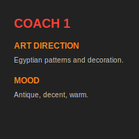
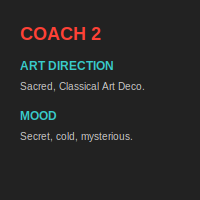
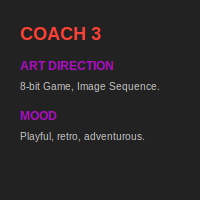
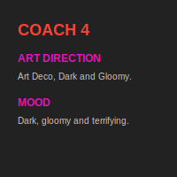
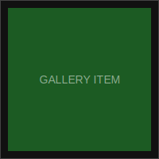

# EXPERIMENTAL LEGO Presentation 🛤️

Esse arquivo é uma reprodução da estrutura visual complexa de uma apresentação de projeto usando o método **LEGO SVG**.

## Layout Experimental

<!-- Header -->
 
<!-- Spacing -->
 
<!-- COACH 1 -->
 
<!-- Spacing -->
 
<!-- COACH 2 -->
 
<!-- Spacing -->
 
<!-- COACH 3 -->
 
<!-- Spacing -->
 
<!-- COACH 4 -->
 
<!-- Spacing -->
 
<!-- GALLERY ROW 1 -->
 
<!-- GALLERY ROW 2 -->

---

### Notas de Implementação
- **Largura Total**: 800px (Soma das larguras horizontais em cada linha).
- **Blocos de Texto**: SVGs dedicados com fontes padrão.
- **Espaçamento**: Blocos cinzas (`gray_100x100.svg`) redimensionados para criar vãos horizontais e verticais.
- **Zero Gaps**: Uso de `align="top"` para manter as linhas coladas.
