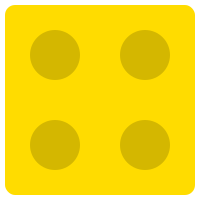

# LEGO SVG README Experiment 🧱

Este repositório é um teste para verificar se é possível criar um layout tipo **LEGO** no GitHub usando múltiplos SVGs individuais que se encaixam, mantendo cada um clicável.

## O Teste

Cada "peça" abaixo é um arquivo SVG individual na pasta `assets/`. Elas foram organizadas em uma tabela para formar um bloco coeso.

<table border="0" cellpadding="0" cellspacing="0">
  <tr>
    <td></td>
    <td colspan="2"></td>
    <td></td>
  </tr>
  <tr>
    <td rowspan="2"></td>
    <td colspan="2" rowspan="2"></td>
    <td></td>
  </tr>
  <tr>
    <td></td>
  </tr>
  <tr>
    <td></td>
    <td></td>
    <td></td>
    <td></td>
  </tr>
</table>

> [!TIP]
> Em muitos ambientes de Markdown (como GitHub), tabelas HTML sem bordas são a melhor forma de criar layouts complexos mantendo a interatividade individual de cada imagem.

---

### Como funciona?
1. **Peças Modulares**: Cada SVG tem um tamanho fixo (ex: 100x100 para 1x1).
2. **Preenchimento**: Quadrados brancos (`white_1x1.svg`) são usados para completar o retângulo e manter a estrutura visual.
3. **Clique Individual**: Cada `` está envolto em um `<a>`, permitindo links diferentes para cada peça.
