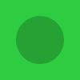

# LEGO SVG README Experiment 🧱

Este repositório testa se é possível criar um layout de **LEGO** no GitHub usando múltiplos SVGs individuais colados sem espaços, mantendo cada um clicável.

## O Teste (Sem Tabela)

Nesta versão, as imagens são colocadas lado a lado sem nenhum espaço entre os links no Markdown.

   

---

### Como funciona?
1. **Zero Whitespace**: Os links `<a>` estão colados um no outro no código Markdown.
2. **Full Bleed SVGs**: Os arquivos removem qualquer borda interna, preenchendo os 100x100 pixels completamente.
3. **Pedaços 1x1**: Para garantir alinhamento perfeito sem tabelas, peças maiores (como a 2x2 amarela) são formadas por múltiplos blocos 1x1.

---

📖 **Quer saber como chegamos aqui?** Confira a [LORE.md](./LORE.md) para ver todo o processo de desenvolvimento e os desafios superados.
