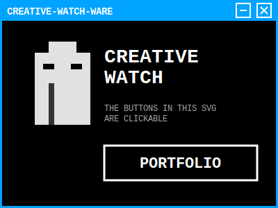

# Terminal Starry Sky 🛸⚡

Experimento de integração de um componente maior (Retro Card) dentro de uma grade LEGO de estrelas.

<table cellspacing="0" cellpadding="0" border="0">
  <tr>
    <td></td>
    <td></td>
    <td></td>
    <td></td>
    <td></td>
    <td></td>
  </tr>
  <tr>
    <td></td>
    <td colspan="4" rowspan="3"></td>
    <td></td>
  </tr>
  <tr>
    <td></td>
    <td></td>
  </tr>
  <tr>
    <td></td>
    <td></td>
  </tr>
  <tr>
    <td></td>
    <td></td>
    <td></td>
    <td></td>
    <td></td>
    <td></td>
  </tr>
</table>

---
### Notas Técnicas
- **Tamanho do Card**: 400x300px (Exatamente **4 colunas** e **3 linhas** do LEGO).
- **Interatividade**: O botão "SCAN" no SVG possui um link interno (`xlink:href`). No GitHub, para garantir a funcionalidade, o card todo foi envolvido em um link adicional.
- **Grade Estável**: O uso de `<table>` com `colspan` e `rowspan` permite "cercar" um componente grande sem quebrar a sincronia da animação das estrelas vizinhas.
