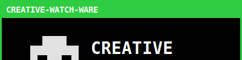

# Starry Sky V2 (LEGO Grid) 🖥️🌌✨

Este grid é formado inteiramente por peças LEGO de 100px de altura, encaixadas sem tabelas ou spacers.

    

---
### Notas de Refatoração
- **LEGO Slices**: O card original (400x300) foi fatiado em **3 tiras de 400x100**.
- **A Bunch of Squares**: Agora o grid flui naturalmente usando apenas o Markdown, sem tabelas, permitindo que cada "peça" seja cercada por estrelas.
- **Sincronia**: A animação de 12s continua sincronizada em todas as peças do mosaico.
