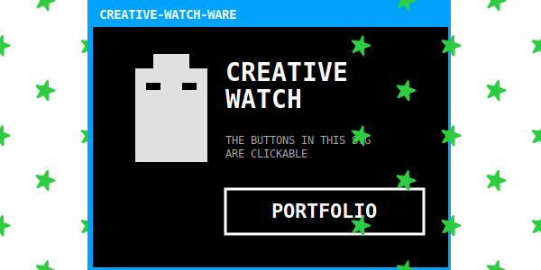

# Starry Sky V2 (Legacy Grid) 🖥️🌌✨

O componente `retro_card.svg` agora está integrado sem tabelas, usando a técnica de `Composite Rows`.

  

---
### Notas de Refatoração
- **Eliminação de Tabelas**: Removida a tag `<table>`, eliminando paddings e bordas indesejadas do GitHub.
- **Técnica de Composição**: Criamos peças LEGO maiores (`star_row_6.svg` e `starry_retro_composite.svg`) que se encaixam perfeitamente na vertical.
- **Sincronia**: Todas as animações SMIL compartilham o mesmo tempo de 12s para manter o grid coeso.
